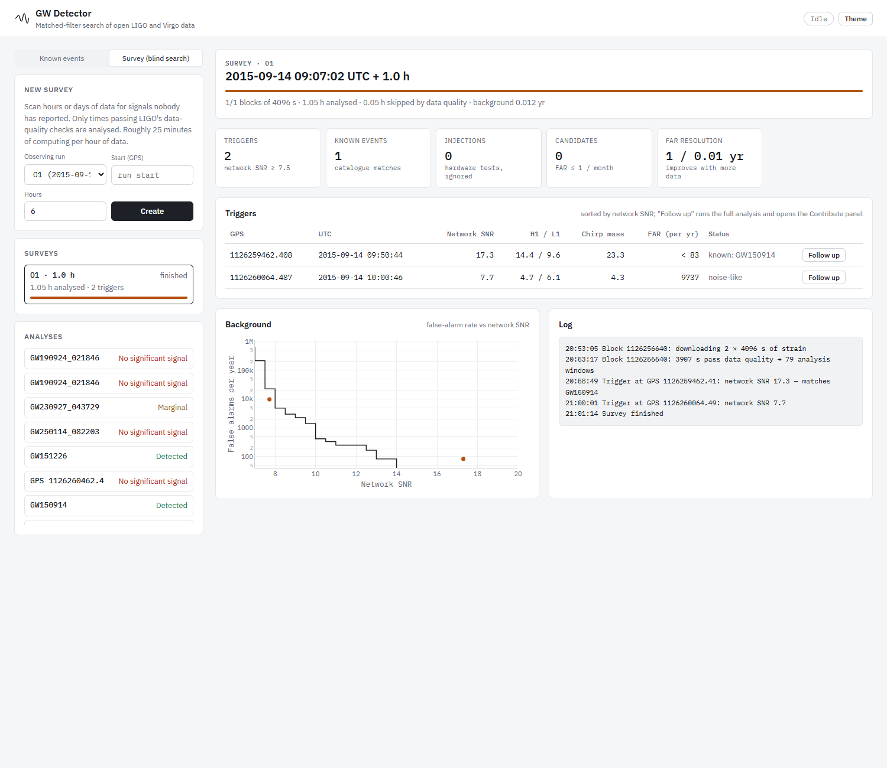

# GW Detector

Re-detects gravitational-wave events from the raw LIGO and Virgo strain data published by GWOSC,
using a matched-filter search written from scratch in NumPy.


## Usage

```bash
./run.sh        # Linux / macOS / WSL
run.bat         # Windows
```

Open http://localhost:8002 and pick an event, or enter any GPS time to search data with no known event.

## Survey: searching for new signals

The Survey tab scans hours to days of an observing run (O1–O4a). It only uses times that pass LIGO's
CBC data-quality categories 1 and 2, flags hardware injections, keeps the loudest coincident trigger per
64 s window, and builds a time-slide background so every trigger gets a false-alarm rate. Triggers are
cross-matched against every GWOSC catalogue and public GraceDB alerts. Surveys can be paused and resumed.
About 10 minutes of computing per hour of data.

## Contributing a candidate

Every analysis has a Contribute panel:

1. Verification checklist: coincidence, SNR, χ², gating, data quality, hardware injections, catalogue and
   public-alert cross-match, false-alarm rate.
2. Candidate package (.zip): LaTeX paper draft with figures (ready for Overleaf or arXiv), full analysis
   data, draft email and a reproduction script.
3. Zenodo: uploads the package as a draft under your name and, after confirmation, publishes it with a DOI.
   Needs a personal access token; uses the Zenodo sandbox until you untick it.
4. Draft email to the LIGO–Virgo–KAGRA collaboration and independent search groups.
5. arXiv submission page (submission itself happens on arXiv; first-time authors need an endorsement).
6. Gravity Spy for glitch-like triggers.



## How it works

1. Reads 128 s of 4 kHz strain around the event from each detector (HTTP range reads of the GWOSC
   files, so only the needed slice is downloaded).
2. High-pass filter, noise spectrum estimate, and gating of loud instrumental glitches.
3. Matched filter against ~530 templates (5–100 M☉): TaylorF2 3.5PN inspiral with a phenomenological
   merger and ringdown.
4. Coincidence: SNR ≥ 4 in at least two detectors within the light travel time between sites.
5. Background from 400 time slides; χ² signal-consistency test.
6. Chirp mass from inspiral-only templates; source-frame value uses the published redshift.

Output: whitened strain with the best-fit waveform, constant-Q time-frequency maps, SNR time series,
background distribution, template bank map, noise spectra, audio of the signal, and a comparison with
the published parameters.

## Tested on

| Event | Result | Network SNR | Chirp mass (det. frame) | Published |
|---|---|---|---|---|
| GW150914 | Detected | 17.3 | 29.0 M☉ | 30.7 M☉ |
| GW151226 | Detected | 11.0 | 9.5 M☉ | 9.8 M☉ |
| GW170814 | Detected (L1 glitch gated) | 12.8 | 26.3 M☉ | 27.2 M☉ |
| GPS 1126260462 (no event) | No significant signal | 6.5 | | |

## Limitations

- Non-spinning templates with an approximate merger: SNR is lower than in the published analyses
  and quiet, high-spin or very unequal-mass events can be missed.
- Binary neutron star signals are longer than the 64 s analysis window and are not covered.
- Background from 400 time slides limits the false-alarm probability to about 1 in 400.
